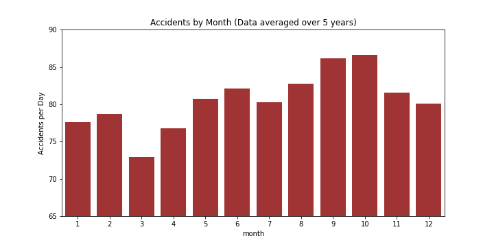
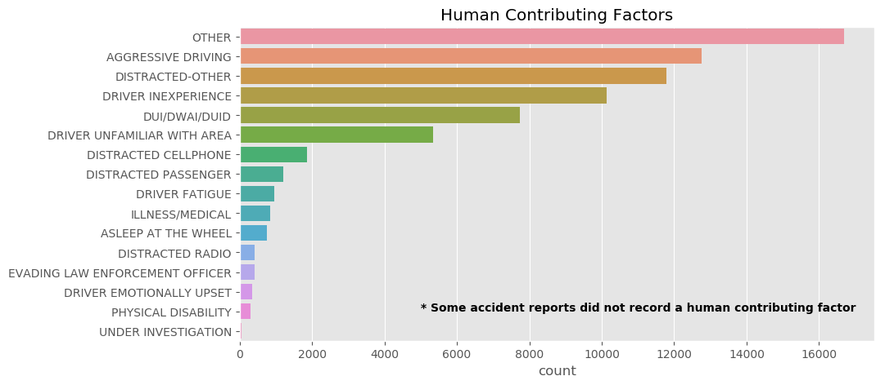
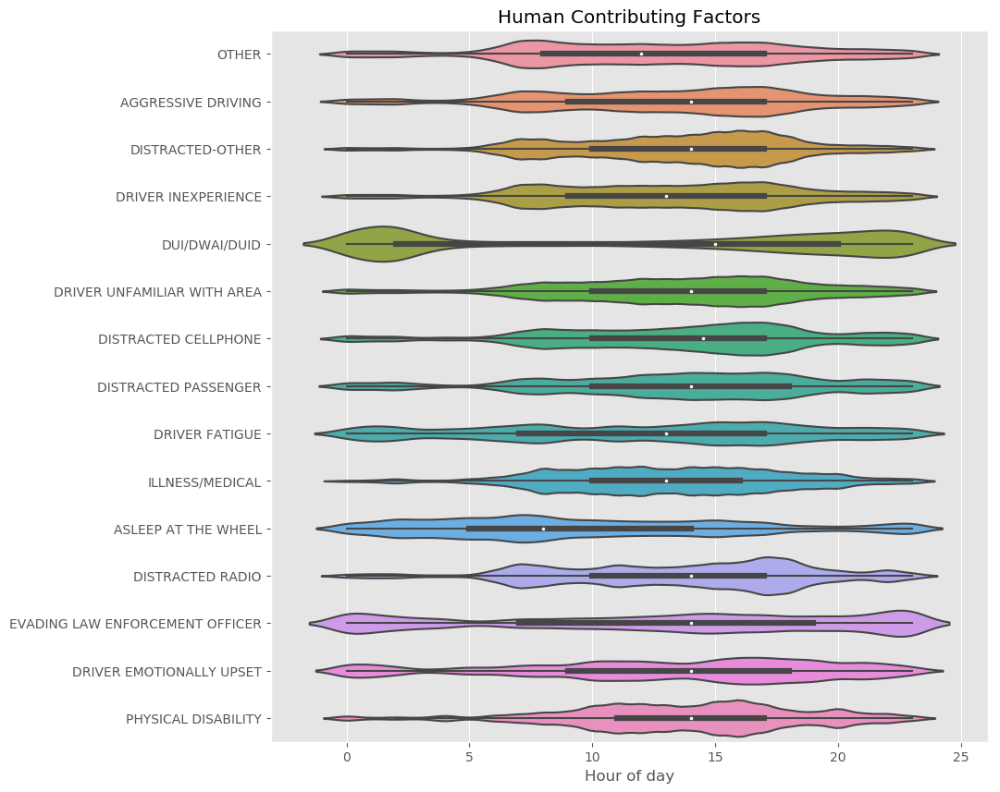
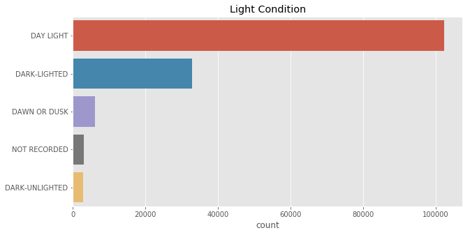

Exploring Accident Data in Denver
=====

**JOHN HERR | Galvanize Data Science Imersive | Spring 2019** 

*Capstone 1: Exploratory Data Analysis*

# Background & Question
According to the [World Health Organization](https://www.who.int/news-room/fact-sheets/detail/road-traffic-injuries), road traffic injuries are the leading cause of death for persons aged 5-29 years. While improvements in automobile safety have significantly reduced the dangers of driving, more than 32,000 people are killed and, 2 million are injured each year from motor vehicle crashes in the US alone each year according to the [CDC](https://www.cdc.gov/vitalsigns/motor-vehicle-safety/index.html).

As a resident in Denver, I was curious about how safe the roads are that I used to commute by bike each day.  I was curious to see if accidents are becoming more frequent over time (possibly due to the population boom), where accidents most frequently occur, and what factors may contribute to or are at least correlated accidents in this city.

# Data
The Denver Open Data Catalog has [a dataset](https://www.denvergov.org/opendata/dataset/city-and-county-of-denver-traffic-accidents)  that includes motor vehicle crashes reported to the Denver Police Department, that occurred within the City and County of Denver and during the previous five calendar years and resulted in at least one thousand dollars in damage, an injury, a fatality, or a drug/alcohol involvement. 

The dataset records more than 156,000 traffic incidents. Most of the recorded incidents include information such as the geographic location of the accident, the road conditions, human factors that may have contributed to the accident, and any injuries or fatalities that  resulted from the accident. 

# Exploratory Data Analysis

## When do Accidents Occur
After importing and cleaning my data, one of my first goals was to determine whether accidents are becoming more common in Denver.  To answer this, I plotted the quarterly total number of accidents from the beginning of 2013 to the end of 2018. There appears to be an increase in the number of accidents year over year, which should be expected, in a city which has seen significant population growth.  What was surprising, was that there appeared to be a significant seasonality component to the number of accidents, with Q1 of each year marking a significant decrease in the overall rate of accidents each year.

To explore this seasonality component further, I decided to look at the monthly averages over the past five years.  Since some months are longer than others, and some years are leap years, I normalized the data to determine the average number of recorded accidents per day in each month of the year. The accident rate appears to increase from March through October and then decrease from October through March of the following year. How interesting!

While the seasonality aspect was surprising, I expected to see a positive correlation between commuting times and the number of accidents. The following 'kde' joint-plot confirms this expectation and reveals that weekdays are particularly bad for traffic accidents between 7-8am and  3-5pm. On the weekends there is an uptick in accidents during the nighttime hours. 

## Top Contributing Factors
Accident reports sometimes list a human contributing factor. Presumably, this field on the accident report is entered at the reporting Officer's discretion.  Further, it appears that this field is incomplete (e.g., it is likely missing significant factors that may have caused some accidents).  Since police officers are only working from a limited knowledge this is expected. Nevertheless,  this information still reveals some interesting data.

For example, it is interesting that "driver inexperience" is so frequently provided as a contributing factor. I had also expected cell-phone usage to be a more common contributing factor, but it is possible that many accidents associated with cell-phone usage are grouped under "Distracted-other." 

Looking at these human contributing factors in a little more detail, I was interested in the correlation between the time of day and when these contributing factors are listed on accident reports. As might be expected, accidents with "DUI," "Driver fatigue," "Asleep at the wheel," "Driver emotionally upset" listed as contributing factors frequently occur during the nighttime hours.

## Where do the most Accidents Occur?
Grouping by the "Address" field, I was able to identify the most common accident locations.  As can be seen below, it appears that the most common places for accidents to occur are onramps or off ramps to the I-25 and I-70 freeways.

| LOCACTION                        | Count|
|------------------------------------|----|
| I25 HWYNB / W 6TH AVE              | 972 |
| I70 HWYEB / N HAVANA ST            | 603 |
| I25 HWYNB / W ALAMEDA AVE          | 572 |
| I70 HWYEB / N PEORIA ST            | 496 |
| W 6TH AVE / N FEDERAL BLVD         | 493 |
| I25 HWYSB / 20TH ST                | 476 |
| I25 HWYNB / 20TH ST                | 423 |
| I25 HWYNB / E HAMPDEN AVE          | 409 |
| I25 HWYSB / W 6TH AVE              | 392 |
| I25 HWYNB / W 23RD AVE             | 373 |
| I70 HWYEB / N NORTHFIELD QUEBEC ST | 363 |
| I25 HWYSB / W ALAMEDA AVE          | 330 |
| I25 HWYNB / W COLFAX AVE           | 327 |
| 8400 PENA BLVD                     | 325 |
| I70 HWYEB / N CENTRAL PARK BLVD    | 304 |

I then looked at these intersections to see if the rate of accidents was relatively constant. As can be seen in the graph below, which only considers  2017 and 2018, there appear to be days or in somecases weeks for each of these, particularly bad intersections. In some cases, these periods seem to correspond between locations, which may be indicative of a contributing factor such as bad weather.

# Mapping Accidents
The above insights are interesting, but one thing I really wanted to be able to do was plot data interactively on a map.  I first tried doing this using `gmap`, the Google Maps API for python, after crashing my browser numerous times when loading the generated html files I transitioned to using `folium ` which allowed me to create the interactive map linked below.

Please note the interactive layers that can be turned on and off:
- *heat_map* - A heat map of accidents. For the folium heatmap parameters, I used a  *radius* of 5 pixels and  a *blur effect* of 3 and a *max intensity* of 60.
- *bike_map* - All accidents involving a cyclist.
- *pedestrian_map* - All accidents involving a pedestrian.
- *dui_map* - All accidents where a DUI was listed as a contributing factor
- *fatalities_map* - All accidents resulting in a fatality

[Link to interactive map](https://s3-us-west-1.amazonaws.com/folium.map/folium_heat.html)

In the event you cannot access the html file locate in my S3 bucket, the html file is also located in the `images/` folder of this repo and can be downloaded and run from your local machine. 

### A few more less interesting plots...

