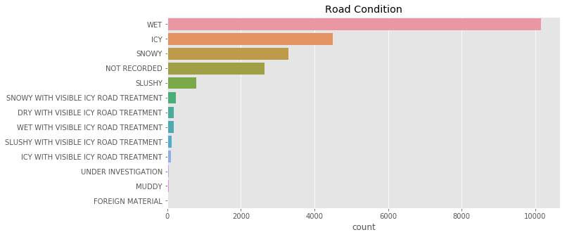

Exploring Accident Data in Denver
=====

**JOHN HERR | Galvanize DSI, Capstone 1 | Spring 2019** 

# Contents
- [Background](#Background)
- [Question](#Question)
- [Data](#Data)
- [Exploratory Data Analysis](#Exploratory Data Analysis)
- [Mapping Accidents](#Mapping Accidents)

# Background
Globally, road traffic injuries are the leading cause of death for persons aged 5-29 years, according to the [World Health Organization](https://www.who.int/news-room/fact-sheets/detail/road-traffic-injuries). While improvements in automobile safety have significantly reduced the dangers of driving, more than 32,000 people are killed and 2 million are injured each year from motor vehicle crashes in the US alone each year according to the [CDC](https://www.cdc.gov/vitalsigns/motor-vehicle-safety/index.html).

# Question
As a resident in Denver I was curious about how safe the roads are that I used to commute by bike every day.  I was curious to see if accidents are becoming more frequent over time (possibly due to the populaton boom), where accidents most freqently occur, and what factors may contribute to or are at least correlated accidents in this city.

# Data
The Denver Open Data Catalog has [a dataset](https://www.denvergov.org/opendata/dataset/city-and-county-of-denver-traffic-accidents)  that includes motor vehicle crashes reported to the Denver Police Department, that occurred within the City and County of Denver and during the previous five calendar years and resulted in at least one thousand dollars or greater in damage, an injury, a fatality, or a drug/alcohol involvement. 

The dataset records over 156,000 incidents. Most recorded incidents include information such as the geographic location of teh accident, the road conditions, human factors that may have contributed to the accident, and any injuries or fatalities that  resulted from the accident. Because the dataset is 

# Exploratory Data Analysis
## When do Accidents Occur
After successfully importing and cleaning the dataset one, my first goals was to determine whether accidents are becoming more common in Denver.  To answer this, I plotted the quarterly total number of accidents from the beginning of 2013 to the end of 2018. There appears to be an increase in the number of accidents year over year, which should be expected, in a city which has seen significant population growth.  What was surprising, was that there appeared to be a significant seasonality component to the number of accidents, with Q1 of each year marking a significant decrease in the overall rate of accidents each year.

To explore this seasonality component further, I decided to look at the monthly averages over the past five years.  Since some months are longer than others, and some years are leap years, I normalized the data to determine the average number of recorded accidents per day in each month of the year. The accident rate appears to increase from March through October and then decrease from October through March of the following year. How interesting!

While the sesonality aspect was a bit suprising, also expected there to be correlation of higher accidents durring morning and evening commmute times. The follwing kde plot confirms that weekdays are particularly bad between 7-8am and and 3-5pm. On the weekends there is an uptick in accidents during the nighttime hours.

Accident reports sometimes list a human contributing factor to an accident. Presumably, this data is entered at the Officer's discretion. It is interesting that "driver inexperience" is so frequently provided as a contributing factor.  I had also expected cell-phone usage to be a more frequent contributing factor, but cases of cell-phone distraction are likely grouped under "Distracted-other."

Looking at these human contributing factors in a little more detail, I was interested in the time-of-day dependence. As might be expected accidents listed as a "DUI," "Driver fatigue," "Asleep at the wheel," "Driver emotionally upset" appear to contribute proportionately high to accidents occurring during the middle of the night.

## Where to the most Accidents Occur?
Grouping by the "Address" field, I was able to identify the most common accident locations.  As can be seen below, it appears that the most common places for accidents to occur are onramps or off ramps to the I25 and I70 freeways.

| LOCACTION                        | Count|
|------------------------------------|----|
| I25 HWYNB / W 6TH AVE              | 972 |
| I70 HWYEB / N HAVANA ST            | 603 |
| I25 HWYNB / W ALAMEDA AVE          | 572 |
| I70 HWYEB / N PEORIA ST            | 496 |
| W 6TH AVE / N FEDERAL BLVD         | 493 |
| I25 HWYSB / 20TH ST                | 476 |
| I25 HWYNB / 20TH ST                | 423 |
| I25 HWYNB / E HAMPDEN AVE          | 409 |
| I25 HWYSB / W 6TH AVE              | 392 |
| I25 HWYNB / W 23RD AVE             | 373 |
| I70 HWYEB / N NORTHFIELD QUEBEC ST | 363 |
| I25 HWYSB / W ALAMEDA AVE          | 330 |
| I25 HWYNB / W COLFAX AVE           | 327 |
| 8400 PENA BLVD                     | 325 |
| I70 HWYEB / N CENTRAL PARK BLVD    | 304 |

I then looked at these intersections to see if the rate of accidents was relatively constant. As can be seen in the graph below, which only considers 2017 and 2018, there appears to be days or weeks for each of these, particularly bad intersections.  While some of this may be random, it would be interesting to see if these periods were correlated with, e.g., bad weather or construction. 

# Mapping Accidents

[Accidents involving bikes](maps/bikes.html)

# A few more plots

